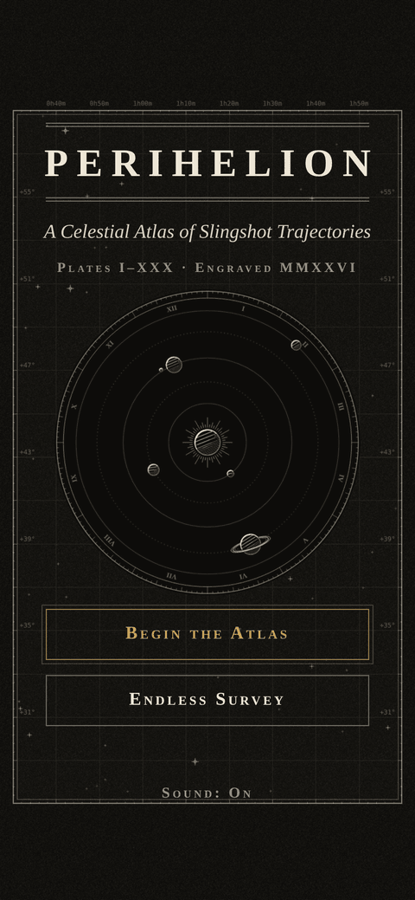
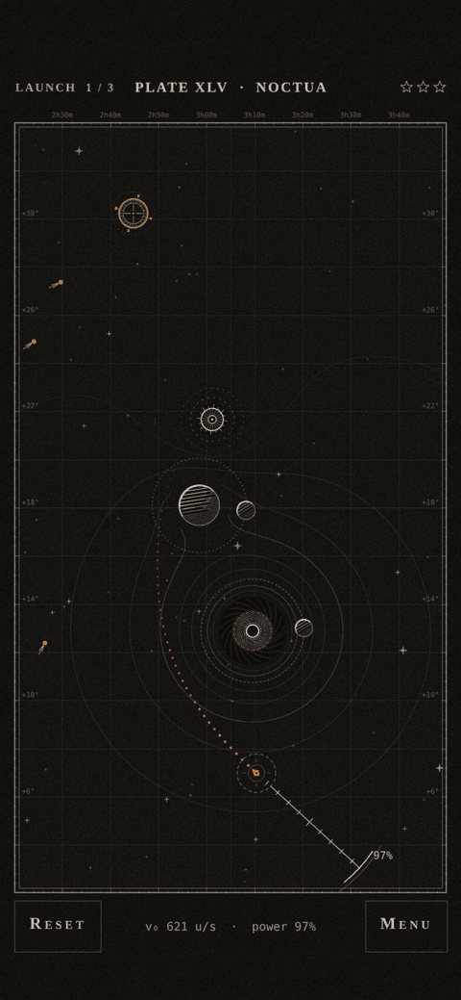
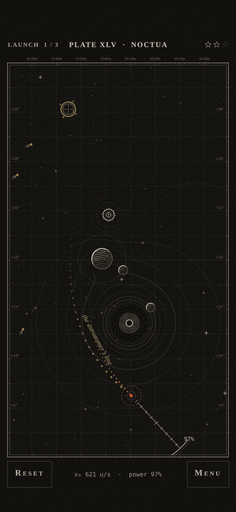
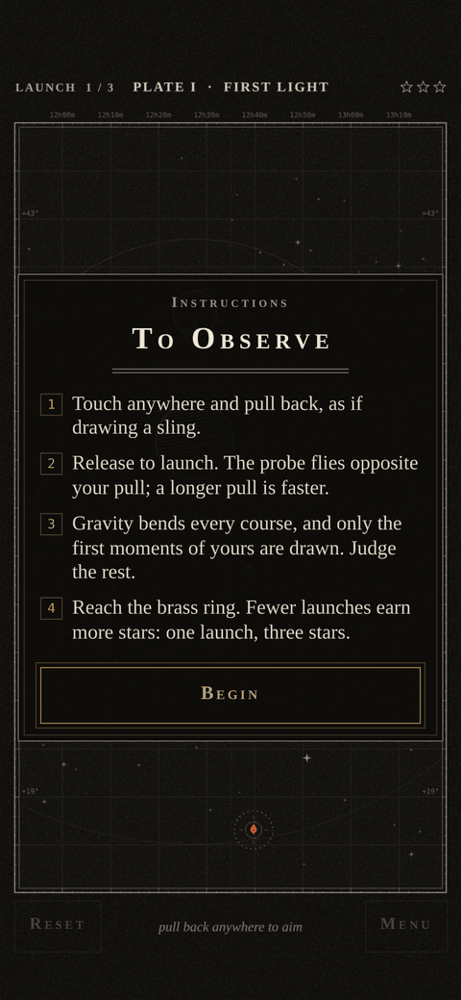
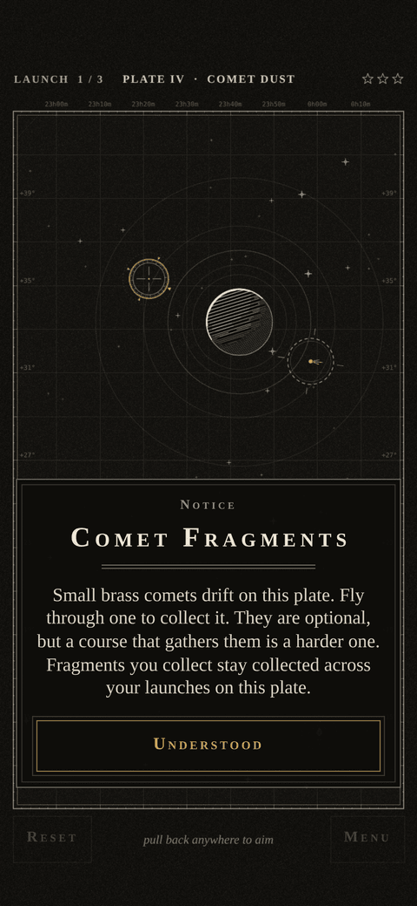
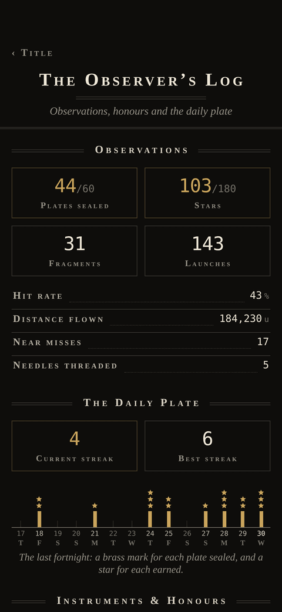

# Perihelion

A gravity-slingshot puzzle game for iPhone, drawn as a 19th-century astronomical engraving.

Pull back anywhere on the screen and release. Your probe curves around planets, moons and black holes, and slips through wormholes, on its way to the brass target ring. You get three launches per plate, and the fewer you use, the more stars you earn.

The whole game is one self-contained HTML file (about 350 KB). There is no server, no build step to play, and no assets other than an optional Google Fonts stylesheet. Add it to your Home Screen and it runs offline.

<p align="center">
  
  
  
</p>
<p align="center">
  
  
  
</p>

## How to play

- **Aim:** touch anywhere and pull back. The probe fires the opposite way, and a longer pull means a faster launch. A short pull (under about 40 units) cancels.
- **Predicted path:** while you aim, a short dotted vermilion line shows only the first 2.25 seconds of the flight, about 22% of the longest possible one. Reading the rest of the course is the puzzle.
- **Three launches per plate:** 1 launch = 3 stars, 2 = 2 stars, 3 = 1 star. Miss three times and the plate is unsealed.
- **Comet fragments:** optional brass comets that sit on harder routes. Once collected they stay collected across your launches on that plate. On every Atlas plate that has them, one launch exists that gathers them all and reaches the ring, which is the only way to earn three stars with the full set (verified with the game's own physics; some are narrow).
- **Hazards:** hitting a body, drifting off the plate, being pulled into a black hole's capture ring, or flying for more than 10 seconds all end the launch.
- **Wormholes:** they come in pairs, marked with the same Greek letter. Fly into one mouth and you leave by its twin at the same speed. A mark such as ↻ 90° means your heading turns that far as you pass through. They pull on nothing and never hurt you, so the puzzle is working out where an exit leads. Some mouths ride rails, so the plate changes with the moment you launch.
- **Instruction cards:** a card explains the controls the first time you play, and others explain comet fragments and wormholes the first time they appear. Both can be reopened from the Menu.

### Modes

- **The Atlas:** 90 plates in three volumes, unlocked in order.
- **Daily Plate:** one plate a day, generated from the date, so everyone gets the same one with no server. It keeps a streak of consecutive days. Harder later in the week.
- **Endless Survey:** generated plates that get harder each round, with a saved best score.
- **Observer's Log:** lifetime statistics (launches, hit rate, distance flown, near misses), your Daily streak, and 31 honours to earn, such as *Thread the Needle* for winning while grazing a body.

### Consult the Astronomer

Open **Menu → Consult the Astronomer** while aiming. The heavens are held still and a brass line shows a course that gathers every comet fragment and reaches the ring: it runs from your probe to just past the last fragment, and the final approach is left for you to read. It costs one star, so a hinted plate sealed in one launch earns 2 stars. You can consult once per attempt. Plates without fragments (I–III), Daily plates and Endless rounds show the first 55% of a plain winning course instead.

### The plates

| Plates | Volume | New mechanic |
|---|---|---|
| I–III | I | Fixed planets |
| IV–V | I | Comet fragments |
| VI–IX | I | Moons on rails |
| X–XIII | I | Binary pairs |
| XIV–XIX | I | Black holes (extra pull, capture ring) |
| XX–XXX | I | Repulsors (negative mass), then everything combined |
| XXXI–LX | II | The same mechanics in denser arrangements: 4–7 bodies, smaller targets, more comets, more moving bodies |
| LXI–XC | III | Wormholes: a single pair, then turned exits, mouths on rails, chains of two pairs, and everything combined |

## Put it on GitHub Pages

1. Create a repository and upload the **contents** of this folder (not the folder itself), so that `index.html` sits at the top level.
2. In the repository go to **Settings → Pages**. Under *Build and deployment* choose **Deploy from a branch**, pick your main branch and the **/ (root)** folder, then save.
3. After a minute or two the game is live at `https://<your-username>.github.io/<repository>/`.

`index.html` and `sw.js` are generated by the build and are committed on purpose, so Pages needs no build step. All paths are relative, so the game also works when it lives in a subfolder of a larger repository.

## Install it on an iPhone (works offline)

1. Open the Pages address in **Safari**. Stay online until the title screen has loaded, which lets the fonts and the offline copy download.
2. Tap **Share → Add to Home Screen**.
3. Launch it from the new icon. It opens full screen and keeps working with no connection.

If the fonts never load, the game falls back to your system serif and monospace fonts and plays the same. After you publish a new version, open the app once while online and then close and reopen it to pick up the update.

Progress is saved on the device in `localStorage` (key `perihelion.v1`), so it does not follow you between phones. Older saves from before the Daily Plate and the extra 30 plates upgrade automatically.

Sound is synthesized in the browser, so the first tap unlocks it. Like any web page, it follows the iPhone ringer switch: with the switch on silent the game is silent too. Use the in-game **Sound** toggle to mute it.

## iPhone app (App Store build)

The same game also builds as a native iPhone app with haptics, Game Center, a share sheet for the Daily Plate and a
backed-up save, with every file inside the app. The web build is not affected by it.

```sh
npm install
npm run ios:sync     # src/ -> ios-www/ -> the Xcode project in ios/
npm run ios:open     # needs a Mac with Xcode 26+ and Node 22+
npm run test:ios     # 59 checks of the app's page and its native layer
```

See [docs/IOS.md](docs/IOS.md) for what the app adds, how to run it, Game Center setup and the App Store checklist. The App Store
listing text is in [docs/APP-STORE.md](docs/APP-STORE.md), and the [privacy policy](privacy.html) and
[support](support.html) pages are served by GitHub Pages with the game.

## Develop

Requires Node 18 or newer. The game itself has no dependencies; `npm install` is only for the test tooling (Playwright and sharp).

```sh
npm run build        # src/  ->  index.html, sw.js, dist/
npm run serve        # http://localhost:8080 (the service worker needs http, not file://)
```

Edit the files in `src/`, then rebuild. Do not edit `index.html` by hand.

### Tests

```sh
npm test             # physics self-test, golden-flight hash, verification of all 90 plates and their full-clear courses
npx playwright install chromium
npm run test:flow    # touch flow, popup cards, Daily, hint, atlas, menus, storage disabled, landscape
npm run test:log     # achievements and stats logic, the Observer's Log screen, toasts
npm run qa           # the whole suite in iPhone emulation: about 420 checks, screenshots, frame timing (about 15 minutes)
npm run perf         # per-frame cost with the CPU throttled 4x, including canvas raster time
```

The suites run in Chromium with iPhone 14 emulation (390×844 at 3× DPR, touch, notch insets). They write screenshots and a report to `qa/`, which is git-ignored.

### Rebuilding the campaign

The 90 plates are baked into `src/20-levels.js` as plain data, so nothing is solved at startup. Volumes I and II (plates I–LX) are frozen: their lines are never rewritten, and `tools/levels-golden.json` pins their hashes because players hold stars against them. Volume III is baked by `tools/levels-bake3.js`.

```sh
npm run bake         # bakes the missing Volume II plates (resumable, two worker processes) and rewrites the CAMPAIGN block
npm run clear        # finds each plate's full-clear course (every fragment + the target) and rewrites the CLEAR block (about 8 minutes)
npm run bake3        # bakes Volume III, the wormhole plates (resumable, two worker processes; designed layouts, see the header of tools/levels-bake3.js)
node tools/levels-daily-test.js   # Daily Plate determinism and timing over 400 dates
```

Changing anything in `src/00-const.js` (other than the aiming-line length and hint size) or the numeric core of `src/10-physics.js` invalidates the baked solutions. Re-bake and re-run `npm test` if you do. The golden hash in `tools/physics-golden.json` exists to catch accidental changes to the physics.

To tune difficulty, `K.PREDICT_STEPS` in `src/00-const.js` sets how much of the path aiming shows (270 steps = 2.25 s). It only affects the preview, so no plate needs re-baking.

## How it works

| File | Job |
|---|---|
| `src/00-const.js` | World size, physics constants, palette, fonts |
| `src/10-physics.js` | Integrator, gravity, collisions, the predictor, `selfTest()` |
| `src/20-levels.js` | Seeded generator (mulberry32), solver, the 90 baked plates, the Endless and Daily generators |
| `src/30-render.js` | Canvas 2D renderer: hatching, contour wells, grid, HUD, hint line, effects, thumbnails |
| `src/40-audio.js` | Web Audio synthesis: drone, bell, thump, pluck, whoosh, honour chime |
| `src/50-save.js` | `localStorage` progress, popup-card flags, Daily record, stats and honours, with an in-memory fallback |
| `src/55-log.js` | Observer's Log: lifetime stats and the 31 honours |
| `src/56-logui.js` | Observer's Log screen and achievement toasts |
| `src/60-main.js` | Game loop, touch input, screens, cards, Daily and hint flows, test hooks (`window.__peri`) |
| `src/shell.*.html` | Page head, styles and markup for the menus |
| `src/native/ios-native.js` | iOS app only: haptics, save backup, Game Center, share (not in the web build) |
| `ios/` | The Xcode project (Capacitor) and Game Center setup sheet |
| `tools/` | Build, tests, level baker, icon generator |

- **Physics:** semi-implicit Euler at a fixed 120 Hz with softened gravity, decoupled from rendering. Moons move on rails driven by an integer step counter, never accumulated time.
- **Deterministic aiming:** the predicted path and the real flight both call the same `createSim` and `stepSim`, so they match point for point. The self-test proves this, including launches at a non-zero start time.
- **Level quality:** every plate is verified to be solvable in a single launch, and the stored solution sits in a cluster of winning shots (at least 8 of the 9 aims within ±1° of angle and ±3% of power also hit). From plate VI on, the straight shot at the target misses, and moving-body plates stay solvable at several launch times, so nothing depends on frame-perfect timing.
- **The astronomer:** each plate stores a verified winning launch, and each Atlas plate with fragments also stores a *full-clear* launch (`Levels.CLEAR`, baked by `tools/levels-clear.js`, kept beside the frozen campaign lines so they stay byte-identical). Consulting the astronomer resets the moons to the start time that launch was solved for, holds them there until you fire, and draws the course: the first 55% of a plain winning path, or on a full-clear course up to just past the last fragment.
- **Look:** five colors only (ink, paper, graphite, vermilion, brass), line art and hatching instead of fills, light from the upper left, no glow. Static layers are pre-rendered to offscreen canvases once per plate.
- **Speed:** a few milliseconds per frame on a busy late plate with the CPU throttled 4x.
- **iOS details:** safe-area insets, no scroll, zoom or text selection, pauses when the page is hidden, canvas resolution capped at 2× for speed.

More detail is in [docs/CONTRACT.md](docs/CONTRACT.md) (the original module contract) and [docs/CONTRACT-v2.md](docs/CONTRACT-v2.md) (the Daily Plate, hint, log and cards addendum).

## Known limits

- **Daily Plate on different browsers:** the plate is generated on the device from the date, and its layout is accepted or rejected by a physics check that uses `Math.sin` and `Math.cos`. Those can differ in the last digit between JavaScript engines, so in rare cases two browsers might settle on different plates for the same date. The plate you get is always verified solvable on your own device. "Today" is your local calendar date.
- **Generated plates are sometimes gentler than asked:** the phone-side solver has a small time budget. When it cannot find a robust solution, it falls back to an easier layout. This affects about a quarter of Daily plates and some late Endless rounds.
- Plate I is only as easy as one planet and a small target allow. The first five plates are all fairly gentle, and the difficulty curve starts in earnest at plate VI.
- It is designed for portrait. Landscape works, but the plate is small.
- `navigator.vibrate` is used where available. iOS Safari does not support it, so there are no haptics on iPhone.
- Wormholes appear only in the Atlas (Volume III). Daily and Endless plates are generated on the phone and do not use them.
- The page is about 354 KiB (362,520 bytes); the QA suite checks a 400 KiB limit. Every feature adds to it, mostly baked plate data.

## Background

Perihelion was built from a single prompt as a test of what a current model can do end to end. A lead agent wrote the shared contract, then physics, level, render and input & feel sub-agents built their modules in parallel, and a QA agent tested the integrated build in iPhone emulation and sent fixes back. The second version (60 plates, Daily Plate, the astronomer's hint, the Observer's Log, the instruction cards and the shorter aiming line) was built the same way. The third (wormholes, Volume III, the full-clear hint courses) added render, sound, log and level agents plus independent review and verification agents.
