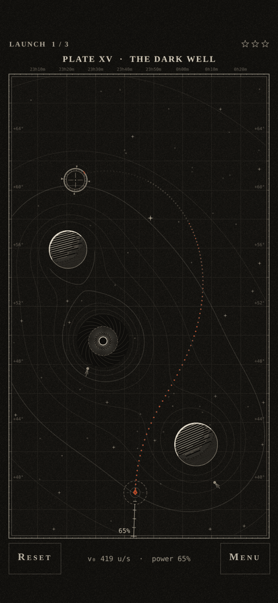
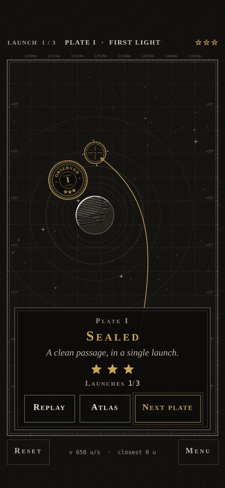

# Perihelion

A gravity-slingshot puzzle game for iPhone, drawn as a 19th-century astronomical engraving.

Pull back anywhere on the screen and release. Your probe curves around planets, moons and black holes on its way to the brass target ring. You get three launches per plate, and the fewer you use, the more stars you earn.

The whole game is one self-contained HTML file (about 190 KB). There is no server, no build step to play, and no assets other than an optional Google Fonts stylesheet. Add it to your Home Screen and it runs offline.

<p align="center">
  
  
  
</p>

## How to play

- **Aim:** touch anywhere and pull back. The probe fires the opposite way, and a longer pull means a faster launch. A short pull (under about 40 units) cancels.
- **Predicted path:** while you aim, a dotted vermilion line shows only the first 35% of the flight. Judging the rest is the puzzle.
- **Three launches per plate:** 1 launch = 3 stars, 2 = 2 stars, 3 = 1 star. Miss three times and the plate is unsealed.
- **Comet fragments:** optional brass comets that sit on harder routes.
- **Hazards:** hitting a body, drifting off the plate, being pulled into a black hole's capture ring, or flying for more than 10 seconds all end the launch.
- **Endless Survey:** generated plates that get harder each round, with a saved best score.

The 30 plates introduce one idea at a time:

| Plates | New mechanic |
|---|---|
| I–III | Fixed planets |
| IV–V | Comet fragments |
| VI–IX | Moons on rails |
| X–XIII | Binary pairs |
| XIV–XIX | Black holes (extra pull, capture ring) |
| XX–XXX | Repulsors (negative mass), then everything combined |

## Put it on GitHub Pages

1. Create a repository and upload the **contents** of this folder (not the folder itself), so that `index.html` sits at the top level.
2. In the repository go to **Settings → Pages**. Under *Build and deployment* choose **Deploy from a branch**, pick your main branch and the **/ (root)** folder, then save.
3. After a minute or two the game is live at `https://<your-username>.github.io/<repository>/`.

`index.html` and `sw.js` are generated by the build and are committed on purpose, so Pages needs no build step. All paths are relative, so the game also works when it lives in a subfolder of a larger repository.

## Install it on an iPhone (works offline)

1. Open the Pages address in **Safari**. Stay online until the title screen has loaded, which lets the fonts and the offline copy download.
2. Tap **Share → Add to Home Screen**.
3. Launch it from the new icon. It opens full screen and keeps working with no connection.

If the fonts never load, the game falls back to your system serif and monospace fonts and plays the same.

Sound is synthesized in the browser, so the first tap unlocks it. On iPhone the game keeps its audio alive with a silent audio track, which means it is audible even when the ringer switch is on silent. Use the in-game **Sound** toggle to mute it.

## Develop

Requires Node 18 or newer. The game itself has no dependencies; `npm install` is only for the test tooling (Playwright and sharp).

```sh
npm run build        # src/  ->  index.html, sw.js, dist/
npm run serve        # http://localhost:8080 (the service worker needs http, not file://)
```

Edit the files in `src/`, then rebuild. Do not edit `index.html` by hand.

### Tests

```sh
npm test             # physics self-test, golden-flight hash, and full verification of all 30 plates
npx playwright install chromium
npm run test:flow    # touch flow, menus, pause, fail and endless flows, storage disabled, landscape
npm run qa           # everything above plus layout, screenshots and frame timing (about 130 checks)
npm run perf         # per-frame cost with the CPU throttled 4x, including canvas raster time
```

The suites run in Chromium with iPhone 14 emulation (390×844 at 3× DPR, touch, notch insets). They write screenshots and a report to `qa/`, which is git-ignored.

### Rebuilding the campaign

The 30 plates are baked into `src/20-levels.js` as plain data, so nothing is solved at startup. To regenerate them:

```sh
npm run bake         # about 4 minutes on two cores; rewrites the CAMPAIGN block in src/20-levels.js
```

Changing anything in `src/00-const.js` or the numeric core of `src/10-physics.js` invalidates the baked solutions. Re-bake and re-run `npm test` if you do. The golden hash in `tools/physics-golden.json` exists to catch accidental changes to the physics.

## How it works

| File | Job |
|---|---|
| `src/00-const.js` | World size, physics constants, palette, fonts |
| `src/10-physics.js` | Integrator, gravity, collisions, the predictor, `selfTest()` |
| `src/20-levels.js` | Seeded generator (mulberry32), solver, the 30 baked plates, the Endless generator |
| `src/30-render.js` | Canvas 2D renderer: hatching, contour wells, grid, HUD, effects, thumbnails |
| `src/40-audio.js` | Web Audio synthesis: drone, bell, thump, pluck, whoosh |
| `src/50-save.js` | `localStorage` progress with an in-memory fallback |
| `src/60-main.js` | Game loop, touch input, screens and menus, test hooks (`window.__peri`) |
| `src/shell.*.html` | Page head, styles and markup for the menus |
| `tools/` | Build, tests, level baker, icon generator |

- **Physics:** semi-implicit Euler at a fixed 120 Hz with softened gravity, decoupled from rendering. Moons move on rails driven by an integer step counter, never accumulated time.
- **Deterministic aiming:** the predicted path and the real flight both call the same `createSim` and `stepSim`, so they match point for point. The self-test proves this, including launches at a non-zero start time.
- **Level quality:** every plate is verified to be solvable in a single launch, and the stored solution sits in a cluster of winning shots (at least 8 of the 9 aims within ±1° of angle and ±3% of power also hit). From plate VI on, the straight shot at the target misses, and moving-body plates stay solvable at several launch times, so nothing depends on frame-perfect timing.
- **Look:** five colors only (ink, paper, graphite, vermilion, brass), line art and hatching instead of fills, light from the upper left, no glow. Static layers are pre-rendered to offscreen canvases once per plate.
- **Speed:** about 2.5 ms per frame on a busy late plate with the CPU throttled 4x.
- **iOS details:** safe-area insets, no scroll, zoom or text selection, pauses when the page is hidden, canvas resolution capped at 2× for speed.

More detail is in [docs/CONTRACT.md](docs/CONTRACT.md), the design contract the modules were built against.

## Known limits

- Plate I is only as easy as one planet and a small target allow. The first five plates are all fairly gentle, and the difficulty curve starts in earnest at plate VI.
- Endless plates are checked with a fast solver on the phone. When it cannot find a robust solution within its budget it falls back to an easier layout, so late Endless rounds are somewhat easier than the late campaign plates.
- It is designed for portrait. Landscape works, but the plate is small.
- `navigator.vibrate` is used where available. iOS Safari does not support it, so there are no haptics on iPhone.

## Background

Perihelion was built from a single prompt as a test of what a current model can do end to end. A lead agent wrote the shared contract, then physics, level, render and input & feel sub-agents built their modules in parallel, and a QA agent tested the integrated build in iPhone emulation and sent fixes back.
